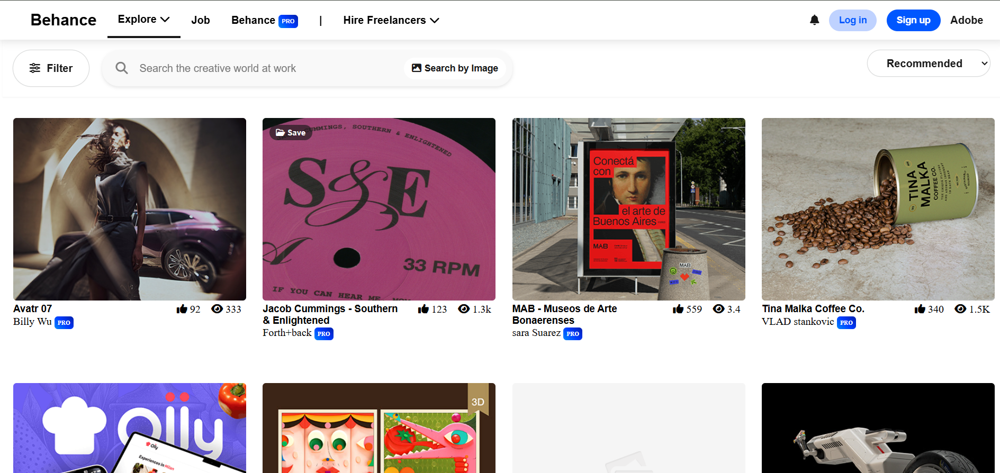

# Behance Clone

## Introduction
A frontend-only group project replicating the UI/UX of Behance, where users can explore creative projects, and interact with a modern design.

## Features 
- **Home Page** Showcase of trending and recent projects
- **User Authentication** Signup Login Page
- **Search Bar** Filter projects by keywords
- **Responsive Design** Optimized for desktop, tablet, and mobile
- **Modern UI/UX** Inspired by Behance’s sleek design

## Tech Stack
- HTML5 – Structure
- CSS3 – Styling + Flexbox + Grid + Animations
- JavaScript (ES6) – Interactivity & DOM manipulation


## Project Structure
```
Behance-Clone/
│── index.html          
|── index.css
|── index.js
│── profile.html        
│── project.html       
│── assets/ 
│── js/                 
│── README.md           
```


# How to Run
```bash
# Clone this repository:
git clone https://github.com/your-repo/behance-clone.git

# Open index.html in your browser.
```

## Screenshots
### Home Page


---
